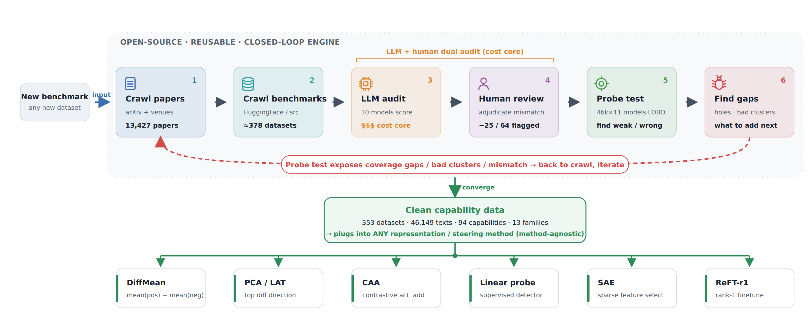
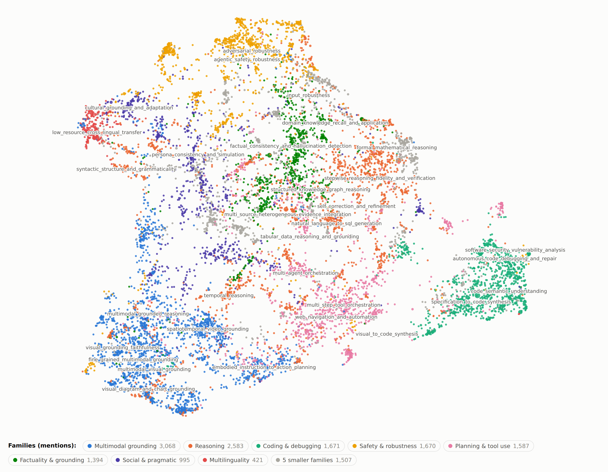
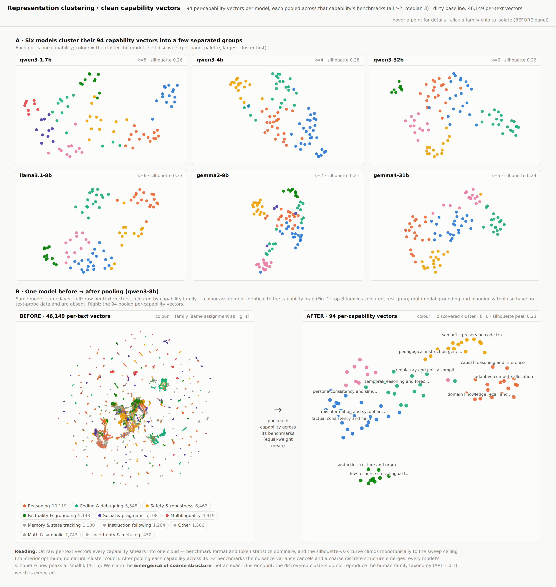
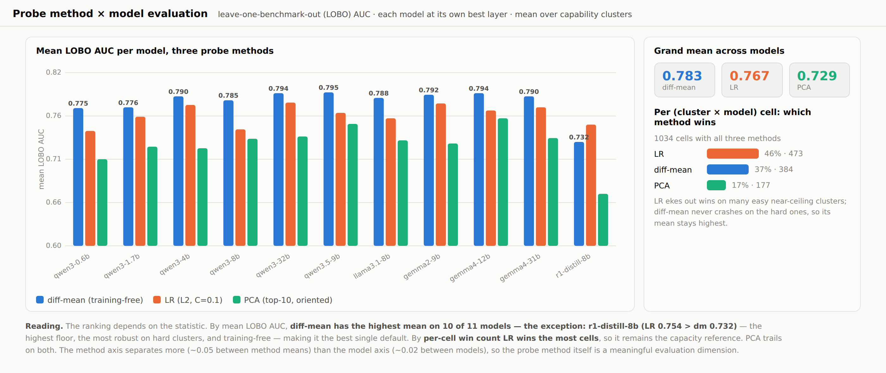

# Latent Capability Representation Benchmark

**Turn *any* evaluation benchmark into clean per-capability representation data — then measure how well capability directions generalize across benchmarks, models, and probing methods.**

Most representation-engineering work extracts a "capability direction" from a single dataset, so the direction inherits that dataset's format and token quirks. This project builds the missing data layer: a capability taxonomy mined from the benchmark literature, a probe corpus where **every capability is backed by ≥ 2 independent benchmarks**, and an evaluation showing that pooling across benchmarks is what makes capability vectors clean — for any model and any probing method.

---

## 1 · The pipeline: an open-source, reusable, closed-loop engine



Given any new benchmark, the pipeline crawls it, audits every text↔capability mapping with a 10-model hidden-state vote plus human adjudication, probe-tests the result, and feeds the exposed gaps back into crawling — a repeatable loop, not a one-off dataset. The output is **method-agnostic**: the same clean data drives DiffMean, PCA/LAT, CAA, linear probes, SAEs, and ReFT-r1 alike (method taxonomy following [AxBench](https://arxiv.org/abs/2501.17148)).

*Interactive version: [`doc/figures/pipeline.html`](doc/figures/pipeline.html)*

## 2 · The capability landscape: what benchmarks actually measure



We crawl **13,427 benchmark papers** and extract **14,896 capability mentions**, which deduplicate into **9,576 concepts** (points above, UMAP layout, size ∝ mentions), clustered into **182 capability clusters across 13 families** (the eight largest families are individually colored — multimodal grounding, reasoning, coding & debugging, safety & robustness, planning & tool use, factuality & grounding, social & pragmatic, multilinguality — the rest fold into gray). Labels mark the largest clusters. **94 of the 182 clusters** are backed by enough text benchmarks to be probed; multimodal grounding (0/31) and planning & tool use (0/23) require image inputs or agentic rollouts and are reported as an explicit coverage gap of text-only probing.

*Interactive version (zoom / search / isolate families): [`doc/figures/capability_map.html`](doc/figures/capability_map.html)*

## 3 · Clean capability representations: before → after pooling



A single benchmark's hidden states carry that benchmark's own fingerprint. Because every capability in our corpus is covered by **≥ 2 benchmarks (median 3)**, we can average each capability's representation *across its benchmarks* — the benchmark-specific variance cancels, leaving a clean per-capability vector.

**(A)** Six models each cluster their 94 pooled capability vectors into a few well-separated groups. **(B)** The same model before vs. after pooling: 46,149 raw per-text vectors smear into one cloud, while the 94 pooled vectors separate cleanly. Quantitatively, silhouette-vs-k climbs monotonically to the sweep ceiling on raw vectors (no natural cluster count) but shows an interior peak at small k (4–15) after pooling — **for every model tested, without exception**. We claim the emergence of coarse structure, not an exact cluster count; the model-discovered clusters do not reproduce the human family taxonomy (ARI ≈ 0.1), which is expected and interesting in its own right.

*Interactive version: [`doc/figures/representation_clusters.html`](doc/figures/representation_clusters.html)*

## 4 · Evaluation: models × probing methods under one protocol



Every (capability, model, method) cell is evaluated with **leave-one-benchmark-out (LOBO)**: the direction is trained without any text from the held-out benchmark and tested on it — cross-benchmark generalization, not memorization. Each model is probed at its own best layer out of four fractional depths (25/50/75/100%).

| | diff-mean | linear probe (LR) | PCA |
|---|---|---|---|
| Mean LOBO AUC (all models) | **0.783** | 0.767 | 0.729 |
| Per-cell wins | 37% | **46%** | 17% |

The honest reading: **diff-mean has the highest mean on 10 of 11 models** (highest floor, training-free — the best single default), while **LR wins the most individual cells** (it ekes out wins on easy near-ceiling clusters but crashes on hard ones). The one exception is instructive: on the R1-distilled Qwen3-8B, LR overtakes diff-mean (0.754 vs 0.732) — and the distillation itself drops diff-mean by 0.053 relative to the *same-architecture* base (Qwen3-8B: 0.785), a controlled hint that reasoning post-training reshapes how linearly capabilities are encoded. The method axis separates more (~0.05) than the model axis (~0.02) — the probing method is itself a meaningful evaluation dimension.

**Models evaluated (11):** Qwen3-0.6B / 1.7B / 4B / 8B / 32B, Qwen3.5-9B, Llama-3.1-8B-Instruct, Gemma2-9B, Gemma4-12B / 31B, and DeepSeek-R1-0528-Qwen3-8B — the latter is a Qwen3-8B distilled on R1 traces (same architecture as Qwen3-8B), included as a post-training contrast rather than an extra architecture family.

*Interactive version: [`doc/figures/method_model_eval.html`](doc/figures/method_model_eval.html)*

---

## Data card

| | |
|---|---|
| Benchmark datasets | 353 (crawled ≈ 378, cleaned by 10-model agreement voting: 64 flagged, 25 removed) |
| Probe texts | 46,149 |
| Capability clusters | 94, **100% backed by ≥ 2 benchmarks** (median 3, max 21) |
| Capability families | 13 |
| Models × layers | 11 models × 4 fractional depths (last-token hidden states) |
| Protocol | leave-one-benchmark-out AUC, stratified negatives |

## Honest limitations

- **Coverage:** multimodal grounding and planning & tool use are absent from the probe corpus (image/agentic inputs needed) — the taxonomy shows exactly how big that gap is.
- **Structure claim:** we claim *coarse* discrete structure emerges after pooling (interior silhouette peak at small k), never "exactly N clusters" — best-k varies by model (4–15).
- **Taxonomy alignment:** model-discovered clusters do not reproduce the human 13-family taxonomy (ARI ≈ 0.1). Models organize capabilities their own way.
- **Method ranking depends on the statistic:** diff-mean wins on means (10 of 11 models), LR on per-cell counts — and on the R1-distilled model LR wins the mean too. We report both.

## Repository layout

```
asset/                          rendered figures (PNG) used in this README
doc/figures/                    interactive HTML versions of the four figures
src/representation_cluster/     representation-fitting pipeline (packaged)
tmp_scripts/
  benchmark_data_crawl/         the working pipeline: crawl → map → clean →
                                extract_hidden.py → probe_clusters.py →
                                method_compare.py → repcluster.py / repclean.py
                                + figure builders (build_fig*.py)
  capability_clustering_v2/     taxonomy mining + the capability map
data/                           progress snapshots
```

## Reproduce

```bash
cd tmp_scripts/benchmark_data_crawl

# 1. extract last-token hidden states (one shard per GPU)
CUDA_VISIBLE_DEVICES=0 python3 extract_hidden.py --model <hf_path> --tag mymodel --shard 0 --nshards 4
#    large fp8 checkpoints: add --device-map auto --dequant-fp8

# 2. diff-mean probe + best-layer selection (LOBO)
python3 probe_clusters.py --tag mymodel

# 3. method comparison at the best layer (diff-mean / LR / PCA)
python3 method_compare.py --tag mymodel

# 4. representation clustering: raw 46k texts (dirty) and pooled 94 vectors (clean)
python3 repcluster.py --tag mymodel
python3 repclean.py   --tag mymodel
```

## Citation

```bibtex
@article{latent_capability_benchmark_2026,
  title   = {A Latent Capability Representation Benchmark: Clean Per-Capability
             Data for Representation Engineering},
  author  = {...},
  journal = {Under review},
  year    = {2026}
}
```
