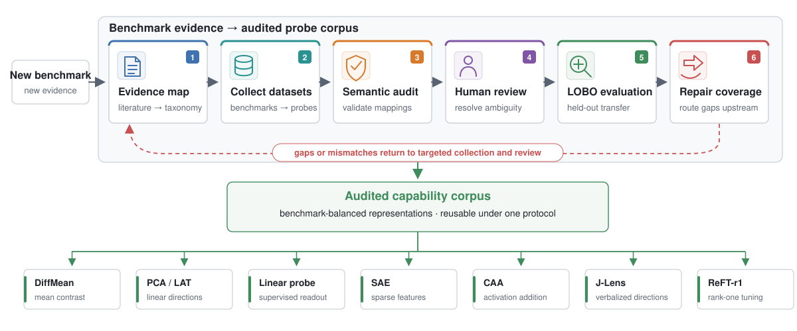
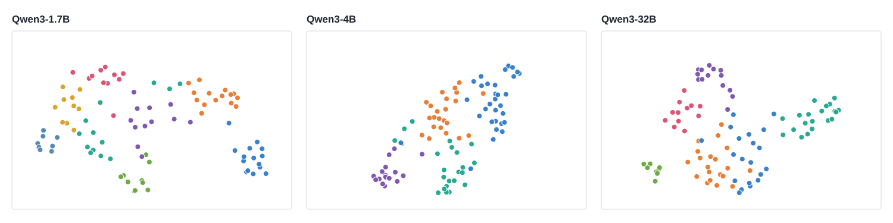
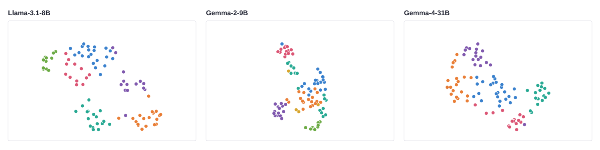
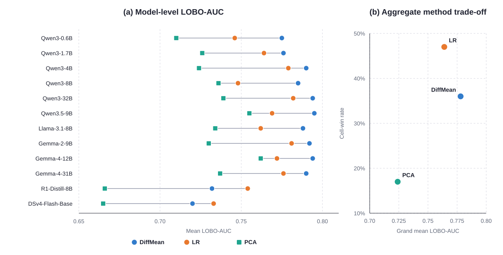

# RepBench: Compiling Benchmarks into Capability Representations for Large Language Models

**English** | [中文](README_zh.md)

**[Paper on arXiv](https://arxiv.org/abs/2607.28008)** · Turn *any* evaluation benchmark into clean per-capability representation data — then measure how well capability directions generalize across benchmarks, models, and probing methods.

Most representation-engineering work extracts a "capability direction" from a single dataset, so the direction inherits that dataset's format and token quirks. This project builds the missing data layer: a capability taxonomy mined from the benchmark literature, a probe corpus where **every capability is backed by ≥ 2 independent benchmarks**, and an evaluation showing that pooling across benchmarks is what makes capability vectors clean — for any model and any probing method.

---

## 1 · The pipeline: an open-source, reusable, closed-loop engine



Given any new benchmark, the pipeline crawls it, audits every text↔capability mapping with a 10-model hidden-state vote plus human adjudication, probe-tests the result, and feeds the exposed gaps back into crawling — a repeatable loop, not a one-off dataset. The output is **method-agnostic**: the same clean data drives DiffMean, PCA/LAT, CAA, linear probes, SAEs, J-Lens, and ReFT-r1 alike.

The updated overview figure shows the complete compile → audit → probe → recrawl loop used in the paper.

## 2 · The capability landscape: what benchmarks actually measure


We crawl **13,427 benchmark papers** and extract **14,896 capability mentions**, which deduplicate into **9,576 concepts** (points above, UMAP layout, size ∝ mentions), clustered into **182 capability clusters across 13 families** (the eight largest families are individually colored — multimodal grounding, reasoning, coding & debugging, safety & robustness, planning & tool use, factuality & grounding, social & pragmatic, multilinguality — the rest fold into gray). Labels mark the largest clusters. **94 of the 182 clusters** are backed by enough text benchmarks to be probed; multimodal grounding (0/31) and planning & tool use (0/23) require image inputs or agentic rollouts and are reported as an explicit coverage gap of text-only probing.

The colors in the figure denote taxonomy families; point size is proportional to benchmark-literature mention count.

## 3 · Clean capability representations: before → after pooling






A single benchmark's hidden states carry that benchmark's own fingerprint. Because every capability in our corpus is covered by **≥ 2 benchmarks (median 3)**, we can average each capability's representation *across its benchmarks* — the benchmark-specific variance cancels, leaving a clean per-capability vector.

The top two panels show the 94 pooled capability vectors for six checkpoints; the bottom panel contrasts Qwen3-8B before versus after pooling. Raw per-text vectors smear into one cloud, while pooled vectors show an interior silhouette optimum at small k (4–15) for every evaluated model. Colors in the pooled panels are model-discovered clusters; raw-vector colors are taxonomy families.

## 4 · Evaluation: models × probing methods under one protocol



Every (capability, model, method) cell is evaluated with **leave-one-benchmark-out (LOBO)**: the direction is trained without any text from the held-out benchmark and tested on it — cross-benchmark generalization, not memorization. Each model is probed at its own best layer out of four fractional depths (25/50/75/100%).

| | diff-mean | linear probe (LR) | PCA | J-Lens |
|---|---:|---:|---:|---:|
| Mean LOBO AUC (1,128 cells) | **0.778** | 0.769 | 0.734 | 0.650 |
| Per-cell wins | 30% | **38%** | 17% | 15% |

The complementary aggregate views favor different readouts: **diff-mean has the highest grand mean** (and is highest on 10 of 12 models), while **LR wins the most individual cells**. PCA trails the two label-using activation readouts. J-Lens is weaker as a detector, but supplies a token-indexed, semantically named interface unavailable to the other methods. The R1-distilled Qwen3-8B and DeepSeek-V4-Flash base model are the two cases where LR has the highest model-level mean.

**Models evaluated (12):** Qwen3-0.6B / 1.7B / 4B / 8B / 32B, Qwen3.5-9B, Llama-3.1-8B-Instruct, Gemma2-9B, Gemma4-12B / 31B, DeepSeek-R1-0528-Qwen3-8B (a Qwen3-8B distilled on R1 traces — included as a post-training contrast, not an extra architecture), and DeepSeek-V4-Flash-Base (fp8 MoE with hyper-connection residual streams; probed as a raw base model — no chat template, the four parallel residual streams averaged, fp8 dequantized to bf16).

The figure reports each method at its own best observed valid depth; the full per-model values and layers are in the [paper](https://arxiv.org/abs/2607.28008).

---

## Data card

| | |
|---|---|
| Benchmark datasets | 353 (crawled ≈ 378, cleaned by 10-model agreement voting: 64 flagged, 25 removed) |
| Probe texts | 46,149 |
| Capability clusters | 94, **100% backed by ≥ 2 benchmarks** (median 3, max 21) |
| Capability families | 13 |
| Models × layers | 12 models × 4 fractional depths (last-token hidden states) |
| Protocol | leave-one-benchmark-out AUC, stratified negatives |

## Honest limitations

- **Coverage:** multimodal grounding and planning & tool use are absent from the probe corpus (image/agentic inputs needed) — the taxonomy shows exactly how big that gap is.
- **Structure claim:** we claim *coarse* discrete structure emerges after pooling (interior silhouette peak at small k), never "exactly N clusters" — best-k varies by model (4–15).
- **Taxonomy alignment:** model-discovered clusters do not reproduce the human 13-family taxonomy (ARI ≈ 0.1). Models organize capabilities their own way.
- **Method ranking depends on the statistic:** diff-mean wins on means (10 of 12 models), LR on per-cell counts — and on the two non-standard models (the R1 distill and the V4 base MoE) LR wins the mean too. We report both.

## Repository layout

```
asset/                          rendered vector figures (SVG) used in this README
doc/figures/                    earlier interactive figure versions
src/representation_cluster/     representation-fitting and evaluation pipeline
  scripts/                      corpus construction, hidden-state extraction,
                                LOBO readouts, SAE, J-Lens, and aggregation
  results/                      frozen depth sweeps and method results
  requirements.txt              pipeline dependencies
data/                           released 46,149-probe corpus and manifests
```

## Reproduce

```bash
python3 -m pip install -r src/representation_cluster/requirements.txt

# 1. extract last-token hidden states (one shard per GPU)
CUDA_VISIBLE_DEVICES=0 python3 src/representation_cluster/scripts/extract_hidden.py --model <hf_path> --tag mymodel --shard 0 --nshards 4
#    large fp8 checkpoints: add --device-map auto --dequant-fp8

# 2. diff-mean probe + best-layer selection (LOBO)
python3 src/representation_cluster/scripts/probe_clusters.py --tag mymodel

# 3. method comparison at the best layer (diff-mean / LR / PCA)
python3 src/representation_cluster/scripts/method_compare.py --tag mymodel

# 4. aggregate method-specific best observed depths
python3 src/representation_cluster/scripts/summarize_four_method_best_depth.py
```

## Citation

```bibtex
@article{li2026repbench,
  title   = {RepBench: Compiling Benchmarks into Capability Representations
             for Large Language Models},
  author  = {Li, Yanshi and Bai, Xueru and Liu, Shuman and Zhang, Long},
  journal = {arXiv preprint arXiv:2607.28008},
  year    = {2026}
}
```
